# 🎫 Queue Implementation in C++

Welcome to my **Queue project in C++**!
This is a **beginner-friendly** explanation of how queues work, why we need them, and how we can implement them ourselves.

I've added **real-life analogies, ASCII diagrams, and examples** to make sure you'll have no doubts left by the end. 💯

---

## 📚 What is a Queue?

👉 Imagine a **line at a ticket counter** 🎟️:

* People join **at the back** → **enqueue**
* People leave **from the front** → **dequeue**
* The **first person** in line gets served **first**

This follows the **FIFO principle**:
**First In, First Out**

---

## 🔄 Real-Life Analogies

* **Printer Queue** - documents print in the order they're sent
* **Customer Service** - first customer in line gets helped first
* **YouTube Buffer** - video data loads and plays in order
* **Message Queue** - messages are processed in the order received

---

## 🔎 Visual Flow of Queue

Let's say our queue capacity = 5 (but can hold 4 elements due to circular design)

```
Initially (empty):
[   ] [   ] [   ] [   ] [   ]
  ^front                ^rear
```

👉 Enqueue 10:

```
[ 10] [   ] [   ] [   ] [   ]
  ^front ^rear
```

👉 Enqueue 20:

```
[ 10] [ 20] [   ] [   ] [   ]
  ^front     ^rear
```

👉 Enqueue 30:

```
[ 10] [ 20] [ 30] [   ] [   ]
  ^front          ^rear
```

👉 Dequeue (removes 10):

```
[   ] [ 20] [ 30] [   ] [   ]
       ^front     ^rear
```

👉 Enqueue 40, 50 (wraps around!):

```
[ 50] [ 20] [ 30] [ 40] [   ]
       ^front            ^rear  (circular behavior!)
```

---

## 🏗️ Features of Our Queue

✅ Enqueue elements (add to rear)\
✅ Dequeue elements (remove from front)\
✅ Check front and rear elements\
✅ Check if empty or full\
✅ **Circular array** - efficient space usage\
✅ Works with any type (`int`, `float`, `string`, etc.)\
✅ Handles copy safely (copy constructor + assignment operator)\
✅ Cleans memory automatically (destructor)

---

## 🔄 Why Circular Array?

Without circular design, the queue would "drift" to the right and waste space:

```
Bad (Linear):
[   ] [   ] [ 30] [ 40] [ 50]  <- front moved right, left space wasted!
```

With circular design, rear wraps around:

```
Good (Circular):
[ 50] [ 60] [ 30] [ 40] [   ]  <- efficient use of all slots!
       ^front            ^rear
```

---

## 🌐 Simple Method Workflows

### Enqueue Operation

```mermaid
flowchart TD
    A[Start] --> B{Is queue full?}
    B -- Yes --> C[Throw Overflow Error 🚫]
    B -- No --> D[Move rear = rear + 1 mod capacity]
    D --> E[Insert element at rear]
    E --> F[End]
```



### Dequeue Operation

```mermaid
flowchart TD
    A[Start] --> B{Is queue empty?}
    B -- Yes --> C[Throw Underflow Error 🚫]
    B -- No --> D[Get element at front]
    D --> E[Move front = front + 1 mod capacity]
    E --> F[Return element]
    F --> G[End]
```



### isEmpty / isFull Check

```mermaid
flowchart TD
    A[Check Queue State] --> B{front == rear?}
    B -- Yes --> C[Queue is Empty ✅]
    B -- No --> D{rear + 1 mod capacity == front?}
    D -- Yes --> E[Queue is Full ⚠️]
    D -- No --> F[Queue has space ⬜]
```



---

## 💻 Code Overview

Here's the header file:

```cpp
#ifndef QUEUE_H
#define QUEUE_H

#include <stdexcept>
#include <iostream>
using namespace std;

template <typename T>
class Queue {
private:
    T *data;       // pointer to hold array
    int capacity;  // maximum size
    int front;     // index of front element
    int rear;      // index of rear element

public:
    // Default Constructor
    Queue();

    // Parameterized Constructor
    Queue(int size);

    // Copy Constructor
    Queue(const Queue &other);

    // Assignment Operator
    Queue &operator=(const Queue &other);

    // Add element to rear
    void enqueue(T value);

    // Remove element from front
    T dequeue();

    // Check if full
    bool isFull();

    // Check if empty
    bool isEmpty();

    // Get current size
    int getSize();

    // Get front element
    T queueFront();

    // Get rear element
    T queueRear();

    // Destructor
    ~Queue();
};

#endif
```

---

## 🧪 Test File: `test_queue.cpp`

```cpp
#include "Queue.h"
#include <iostream>
using namespace std;

int main() {
    Queue<int> q(5);

    cout << "Enqueuing elements..." << endl;
    for (int i = 1; i <= 4; i++) {
        q.enqueue(i * 10);
        cout << "Enqueued " << i * 10 << endl;
    }

    cout << "Front element: " << q.queueFront() << endl;
    cout << "Rear element: " << q.queueRear() << endl;

    cout << "\nDequeuing elements..." << endl;
    while (!q.isEmpty()) {
        cout << "Dequeued: " << q.dequeue() << endl;
    }

    return 0;
}
```

---

## 📊 Example Run

```
Enqueuing elements...
Enqueued 10
Enqueued 20
Enqueued 30
Enqueued 40
Front element: 10
Rear element: 40

Dequeuing elements...
Dequeued: 10
Dequeued: 20
Dequeued: 30
Dequeued: 40
```

---

## 🔍 Queue vs Stack

| Feature | Stack (LIFO) | Queue (FIFO) |
|---------|-------------|--------------|
| **Analogy** | Stack of plates 🥞 | Ticket line 🎫 |
| **Add** | Push (top) | Enqueue (rear) |
| **Remove** | Pop (top) | Dequeue (front) |
| **Order** | Last In, First Out | First In, First Out |
| **Pointers** | 1 (top) | 2 (front & rear) |

---

## 🛠️ Project Structure

```
Queue/
│── Queue.h
│── test_queue.cpp
│── README.md
```

---

## ⚙️ Compile & Run

Simply run:

```bash
g++ test_queue.cpp -o queue
./queue
```

---

## 🎯 Key Concepts Explained

### Why `(rear + 1) % capacity`?

The modulo operator makes the array circular:
* If `rear = 4` and `capacity = 5`, then `(4 + 1) % 5 = 0` → wraps to start!
* This prevents wasting space at the beginning of the array

### Why Can We Only Store `capacity - 1` Elements?

To distinguish between **empty** and **full**:
* Empty: `front == rear`
* Full: `(rear + 1) % capacity == front`

If we filled all slots, both conditions would look the same!

---

## 🌱 Next Steps

✅ Try queue with `string` or `float`\
✅ Implement **priority queue** (elements have priorities)\
✅ Implement **deque** (double-ended queue - add/remove from both ends)\
✅ Learn about **Queue using Linked List**

---

## 🎯 Summary

* Queue = **FIFO** structure
* Operations: enqueue, dequeue, front, rear, isEmpty, isFull
* We used **circular array** for efficient space usage
* Learned **constructor, copy constructor, assignment operator, destructor** in practice
* Circular queues prevent space wastage with modulo arithmetic

---

✨ Congratulations, you now fully understand **Queue in C++** 🎉