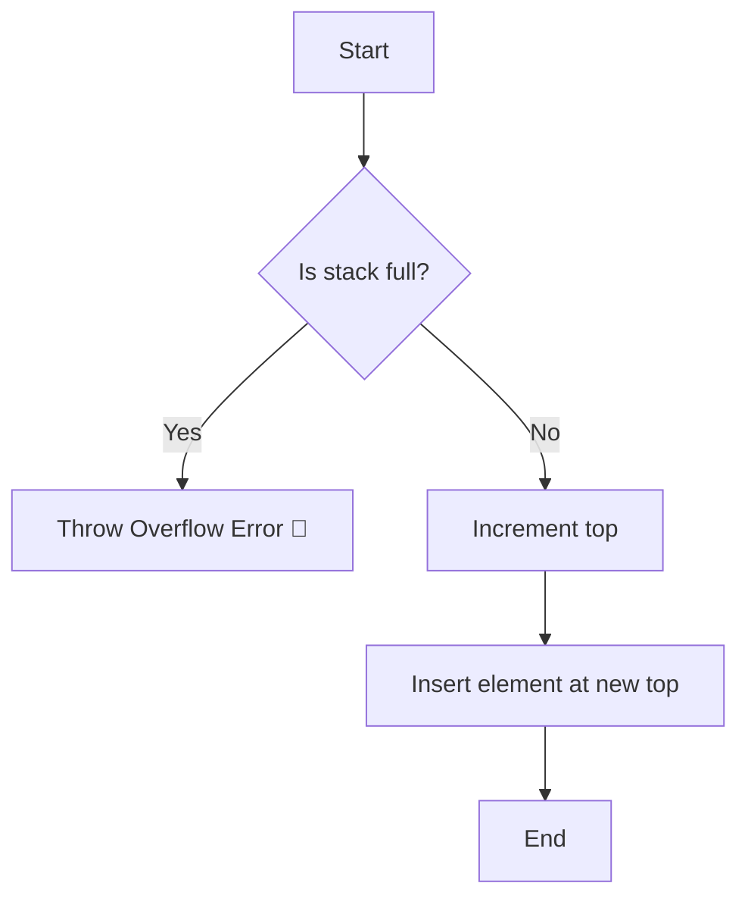
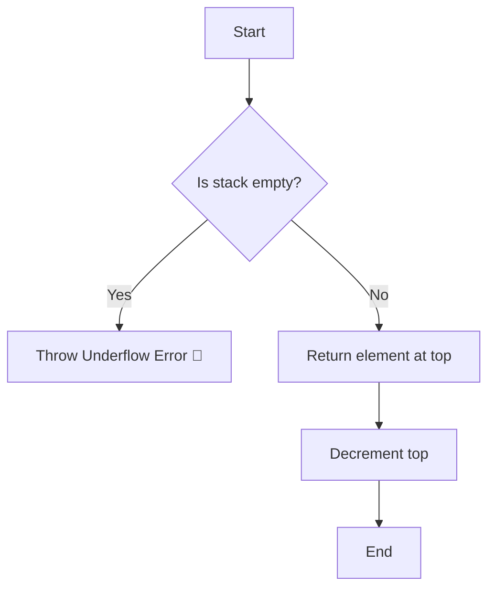
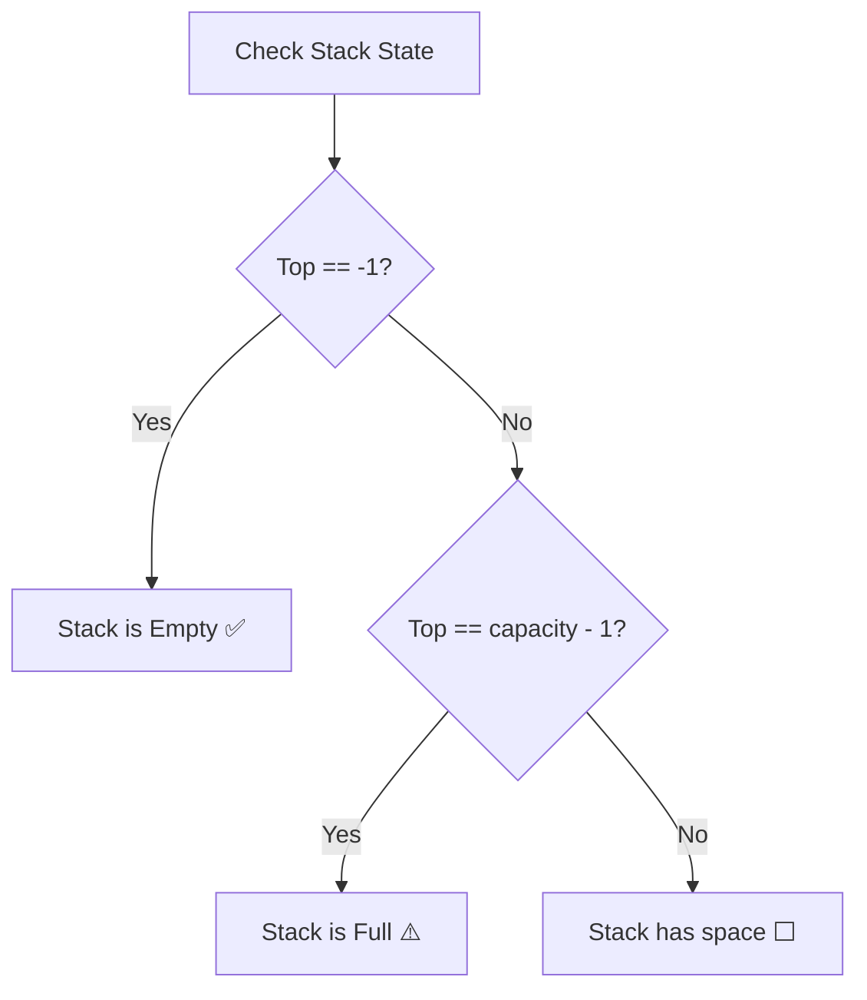

# 🥞 Stack Implementation in C++

Welcome to my **Stack project in C++**!
This is a **beginner-friendly** explanation of how stacks work, why we need them, and how we can implement them ourselves.

I’ve added **real-life analogies, ASCII diagrams, and examples** to make sure you’ll have no doubts left by the end. 💯

---

## 📚 What is a Stack?

👉 Imagine a **stack of plates in a cafeteria** 🍽️:

* You put plates **on top** → **push**
* You take plates **from top** → **pop**
* You **cannot directly reach** the bottom plate

This follows the **LIFO principle**:
**Last In, First Out**

---

## 🔄 Real-Life Analogies

* **Undo/Redo** in a text editor
* **Browser History** (back button works like popping from stack)
* **Function Calls** in programming (functions are pushed on call stack, popped when they return)

---

## 🔎 Visual Flow of Stack

Let’s say our stack size = 5

```
Initially (empty):
[   ] [   ] [   ] [   ] [   ]
  ^ top = -1
```

👉 Push 10:

```
[10 ] [   ] [   ] [   ] [   ]
  ^ top = 0
```

👉 Push 20:

```
[10 ] [20 ] [   ] [   ] [   ]
       ^ top = 1
```

👉 Pop:

```
[10 ] [   ] [   ] [   ] [   ]
  ^ top = 0
```

👉 Pop again:

```
[   ] [   ] [   ] [   ] [   ]
top = -1 (stack empty)
```

---

## 🏗️ Features of Our Stack

✅ Push elements\
✅ Pop elements\
✅ Check top element\
✅ Check if empty or full\
✅ Works with any type (`int`, `float`, `string`, etc.)\
✅ Handles copy safely (copy constructor + assignment operator)\
✅ Cleans memory automatically (destructor)

---


## 🌐 Simple Method Workflows

### Push Operation



### Pop Operation



### isEmpty / isFull



---

## 💻 Code Overview

Here’s the header file:

```cpp
#ifndef STACK_H
#define STACK_H

#include <stdexcept>
#include <iostream>
using namespace std;

template <typename T>
class Stack {
private:
    T *data;       // pointer to hold array
    int capacity;  // maximum size
    int top;       // index of top element

public:
    // Constructor
    Stack(int size);

    // Copy Constructor
    Stack(const Stack &other);

    // Assignment Operator
    Stack &operator=(const Stack &other);

    // Push element
    void push(T value);

    // Pop element
    T pop();

    // Check if full
    bool isFull();

    // Check if empty
    bool isEmpty();

    // Get index of top
    int getTop();

    // Get top element
    T stackTop();

    // Destructor
    ~Stack();
};

#endif
```

---

## 🧪 Test File: `test_stack.cpp`

```cpp
#include "Stack.h"
#include <iostream>
using namespace std;

int main() {
    Stack<int> s1(5);

    cout << "Pushing elements..." << endl;
    for (int i = 1; i <= 5; i++) {
        s1.push(i * 10);
        cout << "Pushed " << i * 10 << endl;
    }

    cout << "Top element: " << s1.stackTop() << endl;

    cout << "Popping elements..." << endl;
    while (!s1.isEmpty()) {
        cout << "Popped: " << s1.pop() << endl;
    }

    return 0;
}
```

---

## 📊 Example Run

```
Pushing elements...
Pushed 10
Pushed 20
Pushed 30
Pushed 40
Pushed 50
Top element: 50
Popping elements...
Popped: 50
Popped: 40
Popped: 30
Popped: 20
Popped: 10
```

---

## 🛠️ Project Structure

```
Stack/
│── Stack.h
│── test_stack.cpp
│── README.md
```

---

## ⚙️ Compile & Run

Simply run:

```bash
g++ test_stack.cpp -o stack
./stack
```

---

## 🌱 Next Steps

✅ Try stack with `string` or `float`\
✅ Implement stack using **linked list**\
✅ Learn **Queue** (opposite of stack → FIFO)

---

## 🎯 Summary

* Stack = **LIFO** structure
* Operations: push, pop, top, isEmpty, isFull
* We used **dynamic arrays** in C++ with proper memory management
* Learned **constructor, copy constructor, assignment operator, destructor** in practice

---

✨ Congratulations, you now fully understand **Stack in C++** 🎉
