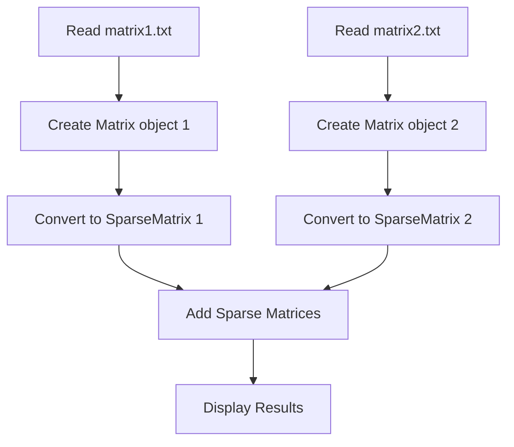

# 🔢 Sparse Matrix Implementation in C++

A beginner-friendly implementation of sparse matrices using object-oriented programming concepts in C++. This project demonstrates how to efficiently store and manipulate matrices that contain mostly zero values.

## 📚 What is a Sparse Matrix?

A **sparse matrix** is a matrix where most of the elements are zero. Instead of storing all elements (including zeros), we only store the non-zero elements to save memory space.

### Example:
```
Regular Matrix (3x3):     Sparse Matrix Representation:
0  3  0                   Row  Col  Value
0  0  0          →        0    1    3
1  0  0                   2    0    1
```

**Memory Usage:**
- Regular matrix: 9 integers (36 bytes)
- Sparse matrix: 2 non-zero elements × 3 values = 6 integers (24 bytes)
- **Savings: 33% less memory!**

## 📁 Project Structure

```
SparseMatrix/
├── 📄 main.cpp           # Main program that demonstrates functionality
├── 📄 Matrix.cpp         # Implementation of regular Matrix class
├── 📄 Matrix.h           # Header file for Matrix class
├── 📄 SparseMatrix.cpp   # Implementation of SparseMatrix class
├── 📄 SparseMatrix.h     # Header file for SparseMatrix class
├── 📄 matrix1.txt        # Sample input file for first matrix
├── 📄 matrix2.txt        # Sample input file for second matrix
└── 🔧 a.exe             # Compiled executable file
```

## 🚀 How to Run

### Prerequisites
- A C++ compiler (g++, Visual Studio, Dev-C++, etc.)
- Basic knowledge of C++ programming

### Steps to Compile and Run:

1. **Download/Clone the project:**
   ```bash
   git clone https://github.com/ZohaibCodez/Data-Structures-Algorithms-CPP
   cd SparseMatrix
   ```

2. **Compile the project:**
   ```bash
   g++ main.cpp Matrix.cpp SparseMatrix.cpp -o a.exe
   ```

3. **Run the program:**
   ```bash
   ./a.exe        # On Linux/Mac
   a.exe          # On Windows
   ```

## 📖 Understanding the Code

### 🏗️ Class Structure

#### 1. Matrix Class (`Matrix.h` & `Matrix.cpp`)
This class represents a regular 2D matrix:

```cpp
class Matrix {
private:
    int** data;    // 2D array to store matrix elements
    int rows;      // Number of rows
    int cols;      // Number of columns
    
public:
    Matrix(int numRows, int numCols);  // Constructor
    void setValue(int row, int col, int value);  // Set element value
    int getValue(int row, int col);              // Get element value
    void display();                              // Print matrix
};
```

**Key Features:**
- ✅ Dynamic memory allocation
- ✅ Bounds checking
- ✅ Memory cleanup (destructor)
- ✅ Operator overloading for `[]`

#### 2. SparseMatrix Class (`SparseMatrix.h` & `SparseMatrix.cpp`)
This class efficiently stores only non-zero elements:

```cpp
class SparseMatrix {
private:
    int non_zero;     // Count of non-zero elements
    int** S_Mat;      // 2D array: [row][col][value]
    
public:
    SparseMatrix(int non_zero_count);
    void Read_SparseMatrix(Matrix& mat);        // Convert from regular matrix
    SparseMatrix AddSparseMatrix(SparseMatrix B); // Add two sparse matrices
    void display();                             // Print sparse matrix
};
```

**Storage Format:**
Each non-zero element is stored as `[row_index, column_index, value]`

### 🔄 Program Flow



## 📋 Input File Format

The program reads matrices from text files. Each file should contain:

### Example: `matrix1.txt`
```
0 3 0
0 0 0
1 0 0
```

### Example: `matrix2.txt`
```
1 0 2
0 4 0
0 0 5
```

**Rules:**
- Each row on a separate line
- Numbers separated by spaces
- Only integer values supported

## 💻 Sample Output

```
=== Sparse Matrix Implementation Demo ===

Original Matrix 1:
Matrix (3x3):
0 3 0 
0 0 0 
1 0 0 

Sparse Matrix A:
Sparse Matrix (Non-zero elements: 2):
Row Col Value
0   1   3
2   0   1

Original Matrix 2:
Matrix (3x3):
1 0 2 
0 4 0 
0 0 5 

Sparse Matrix B:
Sparse Matrix (Non-zero elements: 4):
Row Col Value
0   0   1
0   2   2
1   1   4
2   2   5

Result of Sparse Matrix Addition (A + B):
Sparse Matrix (Non-zero elements: 5):
Row Col Value
0   0   1
0   1   3
0   2   2
1   1   4
2   0   1
2   2   5

Summary:
Matrix A non-zero elements: 2
Matrix B non-zero elements: 4
Result matrix non-zero elements: 5
```

## 🎯 Key Concepts Demonstrated

### 1. **Object-Oriented Programming (OOP)**
- ✅ Classes and Objects
- ✅ Encapsulation (private/public members)
- ✅ Constructors and Destructors
- ✅ Method overloading

### 2. **Memory Management**
- ✅ Dynamic memory allocation (`new`/`delete`)
- ✅ 2D array handling
- ✅ Memory leak prevention

### 3. **Data Structures**
- ✅ 2D arrays
- ✅ Efficient sparse representation
- ✅ File I/O operations

### 4. **Algorithm Implementation**
- ✅ Matrix addition
- ✅ Sparse matrix conversion
- ✅ Efficient storage techniques

## 🔧 Customization Options

### Adding More Operations
You can extend the SparseMatrix class to include:
- Matrix multiplication
- Matrix subtraction
- Matrix transpose
- Element searching

### Different Matrix Sizes
To work with different sized matrices:
1. Modify the file reading function
2. Update input files accordingly
3. Ensure proper memory allocation

## ❗ Common Issues & Solutions

### 1. **Compilation Errors**
```bash
# Make sure all files are in the same directory
# Use proper compilation command:
g++ main.cpp Matrix.cpp SparseMatrix.cpp -o sparse_matrix
```

### 2. **File Not Found**
- Ensure `matrix1.txt` and `matrix2.txt` exist in the same directory
- Check file permissions
- Verify file format (no extra spaces/characters)

### 3. **Memory Issues**
- The program automatically handles memory allocation
- Make sure matrices aren't too large for available RAM

## 🎓 Learning Outcomes

After studying this project, you will understand:

1. **Why sparse matrices are useful** (memory efficiency)
2. **How to implement classes** in C++
3. **Dynamic memory management** techniques
4. **File I/O operations** in C++
5. **Algorithm design** for matrix operations
6. **Object composition** and relationships

## 🚀 Next Steps

### For Beginners:
1. Try modifying the matrix values in the text files
2. Add print statements to see step-by-step execution
3. Experiment with different matrix sizes

### For Advanced Students:
1. Implement matrix multiplication for sparse matrices
2. Add error handling for invalid inputs
3. Optimize the addition algorithm
4. Add support for floating-point numbers
5. Implement sparse matrix using linked lists

## 📞 Support

If you encounter any issues or have questions:
1. Check the common issues section above
2. Make sure your C++ environment is properly set up
3. Verify input file formats
4. Review the code comments for understanding

## 📝 License

This project is for educational purposes. Feel free to use and modify for learning!

---

**Happy Coding! 🎉**

*Made with 🖤 for C++ beginners*
